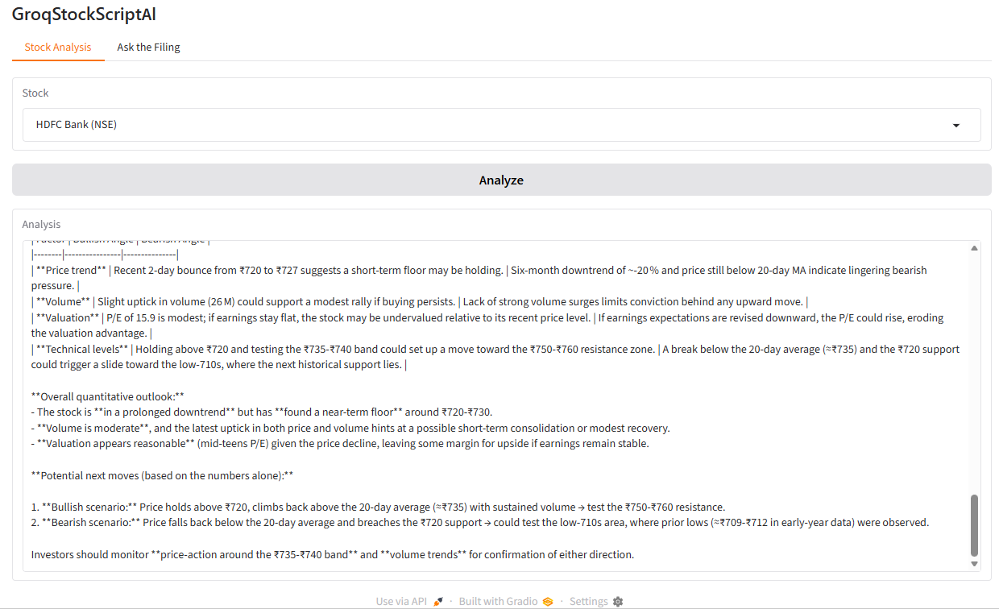
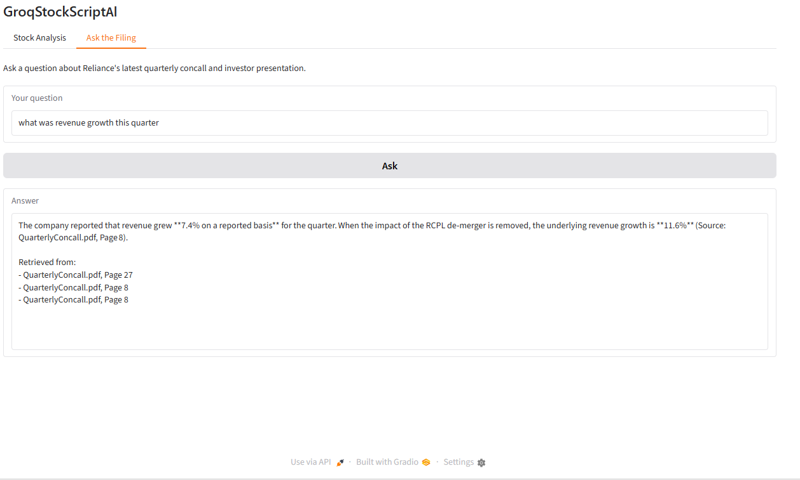

# GroqStockScriptAI

An AI-powered stock research dashboard with two features: a live market summary tool, and "Ask the Filing," a retrieval-augmented generation (RAG) feature for asking grounded questions about a company's quarterly documents.

## Feature 1: Stock Analysis

Select a stock from a curated list of NSE and US tickers, and get an AI-generated market summary built from live data pulled via `yfinance` and analyzed by Groq.



1. User selects a stock from the dropdown (5 NSE + 4 US tickers).
2. `src/stock_data.py` fetches live price, volume, P/E ratio, and the last 6 months of daily history via `yfinance`.
3. That structured data is injected into a prompt sent to a Groq-hosted model (currently `openai/gpt-oss-120b`, accessed through the OpenAI-compatible API) in `src/llm_client.py`.
4. The model returns a data-grounded market summary, displayed in the Gradio UI.

See [product_architecture.md](product_architecture.md), [product_requirement.md](product_requirement.md), and [technical_doc_v1.md](technical_doc_v1.md) for the full system design, requirements, and build log.

**Known limitation**: `yfinance` is an unofficial client for Yahoo Finance data, and Yahoo occasionally rate-limits requests from shared cloud/hosting IP ranges (like Render's). If Stock Analysis briefly returns a "Couldn't fetch data" or rate-limit error, it's an external Yahoo Finance limitation, not an application bug — retrying after a short wait typically resolves it.

## Feature 2: Ask the Filing (RAG)

Ask natural-language questions about Reliance Industries' latest quarterly concall transcript and investor presentation, and get answers grounded strictly in those documents, with source + page citations.



1. On app startup, `rag/loader.py` loads and chunks the bundled PDFs (500 char chunks, 50 char overlap).
2. `rag/indexer.py` embeds the chunks (via Hugging Face's hosted Inference API) and builds an in-memory FAISS vector index.
3. When a user asks a question, `rag/retriever.py` retrieves the top-3 most relevant chunks.
4. `rag/rag_chain.py` stuffs those chunks into a prompt and calls the same Groq client from Feature 1, instructed to answer only from the provided context and say clearly when a question isn't covered by the documents.

See [product_requirement_v2.md](product_requirement_v2.md), [product_architecture_v2.md](product_architecture_v2.md), [adr_001_rag_extension.md](adr_001_rag_extension.md), and [technical_doc_v2.md](technical_doc_v2.md) for the full design, decisions/tradeoffs, and build log for this feature.

## Local setup

```bash
python -m venv .venv
.venv\Scripts\activate
pip install -r requirements.txt
```

Copy `.env.example` to `.env` and add your own keys:

```
GROQ_API_KEY=your_groq_key_here
HF_TOKEN=your_huggingface_token_here
```

Get a Groq key at https://console.groq.com/keys, and a Hugging Face token (used for hosted embeddings in the RAG feature) at https://huggingface.co/settings/tokens.

Then run:

```bash
python app.py
```

## Deployment

Deployed on [Render](https://render.com) as a free web service, connected directly to this GitHub repo. Render auto-redeploys on every push to `main`.

- **Build command**: `pip install -r requirements.txt`
- **Start command**: `python app.py`
- **Environment variables**: `GROQ_API_KEY` and `HF_TOKEN` set via Render's dashboard (Environment tab), never committed to source

## Disclaimer

This project is an independent, personal, open-source project built for educational and portfolio purposes. It is not affiliated with, endorsed by, or connected to Groq, Hugging Face, Yahoo Finance, or any company whose stock ticker data may appear in this application. All market data is sourced from publicly available APIs. This tool does not constitute financial advice.

## Author

Manoj Kumar Yadav

## License

MIT — see [LICENSE](LICENSE).
